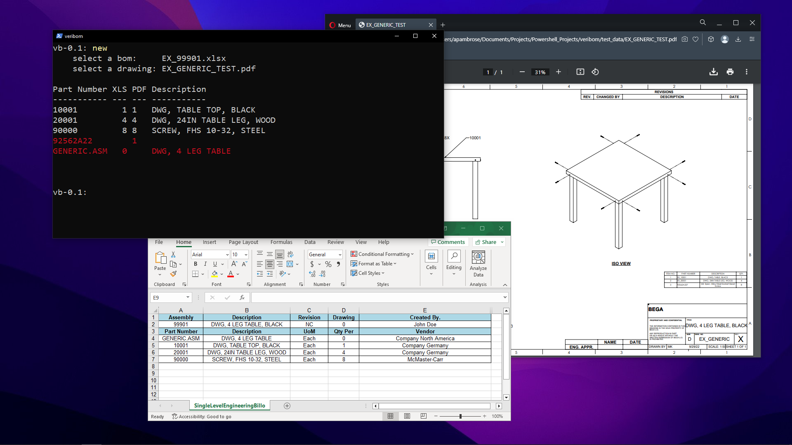

# veribom
"let me just ⌘f this drawing" no more!



## Installing
To install veribom, open a new `command prompt` and run this command
```
powershell iex (curl https://github.com/AustinPAmbrose/veribom/raw/main/install.ps1 -UseBasicParsing)
```

## Checking a BoM against a PDF Drawing
1. Enter `new` at the veribom prompt to start a new BoM check
2. Select an Excel BoM and a PDF drawing
3. The output table will highlight parts red where the quanties on the BoM and PDF differ
4. Enter `clear` if you'd like to clear the veribom window
